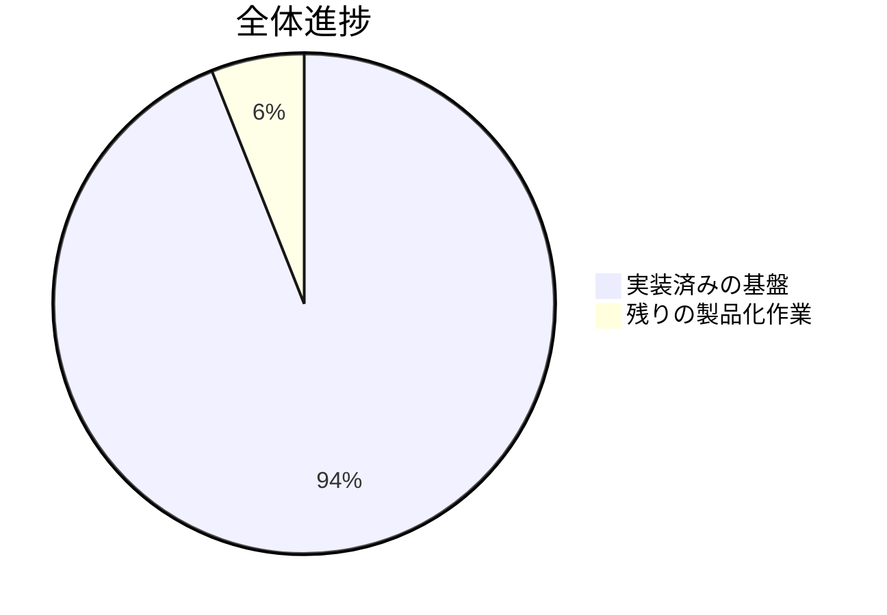
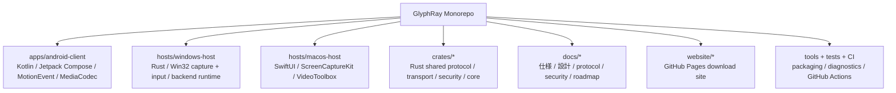
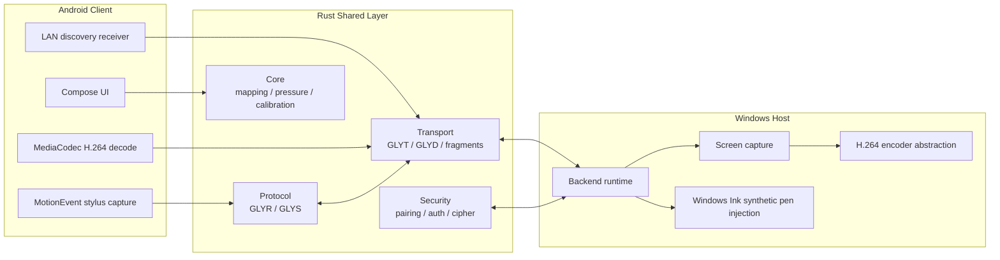
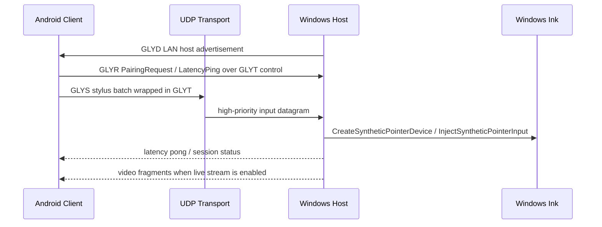
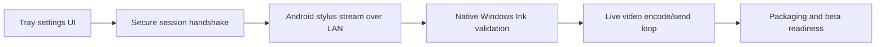

# GlyphRay

[English README](README.md)

GlyphRay は、Android タブレットやスマートフォンを Windows / macOS コンピューターの高品質なリモート・ペンディスプレイとして使うための、低遅延リモートクリエイティブデスクトップアプリです。

目標は、Parsec のような速さ・シンプルさ・低遅延体験を参考にしつつ、コード、UI、ブランド、プロトコル、アーキテクチャは完全にオリジナルにすることです。最大の差別化ポイントは、Android のスタイラス入力、とくに Samsung S Pen の入力を、単なるマウス入力ではなく Windows Ink / native pen input として Windows host に届けることです。

## 現在の進捗

**全体進捗見積もり: 94%**

最終更新: 2026-05-15 JST



| 領域 | 状態 | 進捗 |
| --- | --- | ---: |
| Milestone 1 基盤構築 | 完了 | 100% |
| Milestone 2 映像・transport 基盤 | 進行中 | 92% |
| Milestone 3 Android stylus から Windows Ink | 進行中 | 90% |
| Milestone 4 security hardening / packaging | 進行中 | 84% |
| Milestone 5 macOS / audio / relay | 進行中 | 52% |

```text
M1 基盤構築                  [####################] 100%
M2 映像 + Transport          [##################--]  92%
M3 Stylus -> Windows Ink     [##################--]  90%
M4 Security + Packaging      [#################---]  84%
M5 macOS + Audio + Relay     [###########---------]  52%
```

開発日記: [docs/DEVELOPMENT_DIARY.md](docs/DEVELOPMENT_DIARY.md)

## リポジトリ全体図



| パス | 役割 | 現在入っているもの |
| --- | --- | --- |
| `apps/android-client` | Android client | Compose UI、LAN host discovery、control handshake send/receive、Android Keystore public-key pairing identity、stylus diagnostics、live stylus UDP sender、MediaCodec decode surface |
| `hosts/windows-host` | 最優先の desktop host | LAN backend runtime、UDP routing、QoS outbound queues、approved-peer video fragment queueing、health/status metrics、pending peer hardening、native permission dialog、signed trusted-device challenge/response、GDI capture fallback、encoder abstraction、Win32 synthetic pen injection wrapper |
| `hosts/macos-host` | Phase 2/5 の desktop host | SwiftUI shell、ScreenCaptureKit display enumeration、live capture probe、live capture-to-VideoToolbox encode probe、GlyphRay video packetizer probe、permission readiness UI、Keychain smoke test |
| `crates/core` | 共有ロジック | coordinate mapping、calibration、pressure curve、session state |
| `crates/protocol` | binary protocol | `GLYR` frame、compact `GLYS` stylus batch |
| `crates/transport` | realtime packet layer | UDP `GLYT`、LAN discovery `GLYD`、video fragmentation、reusable UDP buffers、secure datagram、reconnect、bitrate / keyframe adaptation logic |
| `crates/security` | pairing / session security | pairing code、HMAC challenge response、session cipher、replay guard、secret-store trait |
| `crates/telemetry` | local diagnostics | latency breakdown、rolling metrics |
| `crates/audio` | audio 基盤 | audio packetization primitives |
| `docs` | knowledge base | architecture、security、Windows Ink、Android stylus、macOS、test plan、performance targets |
| `website` | GitHub Pages site | 静的 download page、生成 hero image、release links、setup command generator |

## システム構成



## 実行時の流れ



## いま実装済みの主な内容

- Rust workspace と共有 crate 群。
- stylus、media、session、pairing、latency、control 用の versioned binary protocol。
- Android と Rust で揃えた高頻度 stylus packet format `GLYS`。
- coordinate mapping、calibration、pressure curve の実装と unit tests。
- Android Compose app の polished host list / pairing / connection readiness / session cockpit / pen settings / video settings / security / diagnostics 画面。
- Android の raw stylus diagnostics。pressure、tilt、orientation、hover、button、eraser、history、timestamp を表示。
- Rust host の `GLYD` advertisement を読む Android LAN discovery。
- `GLYT` control channel で `PairingRequest` と `LatencyPing` を送る Android control sender。pairing には Android Keystore public key bytes も載せ、host 側の device fingerprinting に使う。
- `PairingResult` と `LatencyPong` を受け取る Android control response receiver。
- pairing 後に host monitor geometry を受け取る Android display-info receiver。
- Android video settings で discovery 済み host display を選択でき、選択 display id は stylus / touch / mouse input packet に乗る。
- resolution、refresh rate、bitrate、color space、codec、touch mode、fullscreen mode、Bluetooth keyboard / mouse capture、game controller capture、special-key overlay の Android video/session settings。
- Android は video / input preferences を保存し、stream quality、touch mode、capture toggle、fullscreen preference が app restart 後も残る。
- Android session fullscreen は system bar を隠す immersive mode に入り、active session 中は画面スリープを抑制する。
- Tailscale IP / MagicDNS / direct endpoint 用の Android manual host entry。保存した endpoint は次回起動時に host list へ復元される。
- remote session の描画面から stylus、native touch、Bluetooth mouse、keyboard、gamepad input を拾い、QoS-aware background worker で UDP 送信する Android bridge。
- Android touch mode は direct native touch、trackpad 的な cursor movement、two-finger gesture wheel translation に対応。
- Android の realtime receive path は、transport socket で受けた `VideoFrame` packet を `RemoteVideoStreamController` と MediaCodec decoder へ流せるようになった。
- Android の low-latency `SurfaceView` と `MediaCodec` H.264 decoder 基盤。
- Windows backend runtime。LAN discovery、UDP server routing、session registry、pairing request handling、console approval / rejection、optional native permission dialog、`PairingResult`、display-info response、encoder config intake、opt-in keyboard / mouse / touch injection、gamepad decode、permission gate、latency pong。
- Windows backend hardening。pending session cap、IPごとの pending attempt rate limit、late input packet drop、channel-aware nonblocking QoS outbound queue、approved-peer video fragment queueing、console-visible queue/backpressure health metrics。
- Windows host は approved device を local host settings に記録し、Android public-key SHA-256 fingerprint と DER public key がある場合は保存する。returning device には `AuthChallenge` を返し、Android Keystore の ECDSA `AuthResponse` を検証してから承認する。`trust list`、`trust forget <id>`、`trust clear` で管理できる。
- Windows host の video pump は approved client の `EncoderConfig` で再起動でき、host console の `encoder override` command でも stream 設定を変更できる。
- Windows host は `encoder save` で default encoder override を保存し、backend startup 時に復元し、`encoder clear` で消せる。さらに `encoder preset save|apply|delete|list` で名前付き stream preset を管理できる。
- Windows host は `GLYPHRAY_ENABLE_PERMISSION_DIALOG=1` で incoming pairing request に対する Win32 connection permission dialog を出せる。
- Windows host は `startup status`、`startup enable`、`startup disable` で per-user startup-at-login を管理できる。
- Windows runtime input bridge は、display enumeration ができる場合、固定の smoke-test rectangle ではなく選択 display geometry から mapper を作る。
- Windows stylus bridge は Win32 synthetic pen injector に渡す前に pen axis を正規化し、pressure を平滑化する。
- LAN stylus path の smoke test 用 development auto-approval mode。
- LAN smoke test 用の Windows backend opt-in native pen injection bridge。
- Windows stylus input bridge と Win32 synthetic pen injection wrapper。
- Windows monitor enumeration、GDI capture fallback、encoder abstraction、streaming pipeline の形。
- ChaCha20-Poly1305 session cipher、replay guard、secure datagram codec、reconnect、adaptive bitrate decision、packet loss 時の keyframe recovery signaling 基盤。
- Windows `PlatformSecretStore` は Windows 上で DPAPI 保護の per-user secret file を使う。non-Windows build では in-memory fallback を使う。
- macOS SwiftUI shell、ScreenCaptureKit display diagnostics、live capture frame probe、ScreenCaptureKit-to-VideoToolbox encode probe、GlyphRay Video-channel packetizer probe、permission readiness checks、CGEvent mouse / keyboard 基盤、Keychain secret-store smoke test、audio permission plumbing。
- Rust tests、Android unit tests、Android debug build、`macos-14` 上の macOS SwiftPM host build 用 GitHub Actions CI。
- GitHub Pages 用の静的 download site。setup command generator と original hero artwork 付き。

## ビルドと実行

### Rust workspace

安定版 Rust を入れて実行します。

```powershell
cargo test --workspace
```

Windows diagnostics:

```powershell
cargo run -p glyphray-pen-diagnostics
cargo run -p glyphray-capture-diagnostics
cargo run -p glyphray-host-diagnostics
```

Windows backend runtime:

```powershell
cargo run -p glyphray-windows-host -- serve
```

backend 起動中は host console で `encoder status`、`encoder override 1920x1080 120 35000`、`encoder save`、`encoder preset save studio-120`、`encoder preset apply studio-120`、`encoder preset delete studio-120`、`encoder clear` を使い、stream-control smoke test ができます。`encoder save` は active host override、または最新の approved client `EncoderConfig` を保存し、次回 backend startup 時に復元します。名前付き preset は default override と同じ設定ファイルに保存され、60fps / 120fps / bitrate 検証を素早く切り替えるために使えます。

user-logon startup の管理:

```powershell
cargo run -p glyphray-windows-host -- startup status
cargo run -p glyphray-windows-host -- startup enable
cargo run -p glyphray-windows-host -- startup disable
```

LAN test で host 側の native permission dialog を使う場合:

```powershell
$env:GLYPHRAY_ENABLE_PERMISSION_DIALOG='1'
cargo run -p glyphray-windows-host -- serve
```

起動中の host console では trusted-device 管理もできます。

```powershell
trust list
trust forget trusted-192-168-1-20-44999
trust clear
```

approval を意図的に bypass して local input path を smoke test する場合だけ、明示的に development auto-approval を有効にします。

```powershell
$env:GLYPHRAY_DEV_AUTO_APPROVE='1'
$env:GLYPHRAY_ENABLE_PEN_INJECTION='1'
$env:GLYPHRAY_ENABLE_TOUCH_INJECTION='1'
$env:GLYPHRAY_ENABLE_MOUSE_INJECTION='1'
$env:GLYPHRAY_ENABLE_KEYBOARD_INJECTION='1'
$env:GLYPHRAY_ENABLE_VIDEO_STREAM='1'
cargo run -p glyphray-windows-host -- serve
```

### Android client

Android Studio または Android SDK command-line tools を入れて実行します。

```powershell
.\gradlew.bat :apps:android-client:assembleDebug
```

現在の Android app には、LAN host discovery、stylus diagnostics、session UI、latency overlay、remote-session stylus UDP bridge、H.264 frame 受信用の MediaCodec-backed decoder surface が入っています。

Gradle / Android 作業は JDK 17 が一番安全な基準です。wrapper は Gradle 8.14.3 に固定しているため Java 24 のローカル test も通りますが、JVM の native-access warning が出る場合があります。

```powershell
.\gradlew.bat :apps:android-client:testDebugUnitTest
```

### macOS host

macOS 13+ と Xcode がある環境で実行します。

```bash
cd hosts/macos-host
swift build
```

Windows から開発している場合は、[ci.yml](.github/workflows/ci.yml) の `macOS host SwiftPM build` job が macOS host の推奨検証経路です。

macOS host はまだ Phase 2/5 の基盤です。native pen injection の主戦場は Windows です。

## 重要ドキュメント

| ドキュメント | 内容 |
| --- | --- |
| [docs/PRODUCT_SPEC.md](docs/PRODUCT_SPEC.md) | product goal、対象ユーザー、制約 |
| [docs/ARCHITECTURE.md](docs/ARCHITECTURE.md) | システム境界と component diagram |
| [docs/PROTOCOL.md](docs/PROTOCOL.md) | binary protocol と message shape |
| [docs/SECURITY.md](docs/SECURITY.md) | threat model と security requirements |
| [docs/WINDOWS_INK_INJECTION.md](docs/WINDOWS_INK_INJECTION.md) | Windows native pen injection notes |
| [docs/ANDROID_STYLUS_CAPTURE.md](docs/ANDROID_STYLUS_CAPTURE.md) | Android stylus capture / packetization |
| [docs/BACKEND.md](docs/BACKEND.md) | Windows backend runtime notes |
| [docs/WINDOWS_STARTUP_AND_SERVICE.md](docs/WINDOWS_STARTUP_AND_SERVICE.md) | startup-at-login 実装と service/agent 制約 |
| [docs/ROADMAP.md](docs/ROADMAP.md) | milestone checklist |
| [docs/TEST_PLAN.md](docs/TEST_PLAN.md) | validation plan |
| [docs/PERFORMANCE_TARGETS.md](docs/PERFORMANCE_TARGETS.md) | latency / telemetry targets |
| [docs/FEATURE_MATRIX.md](docs/FEATURE_MATRIX.md) | video / input / fullscreen / special keys / host startup の実装状況 |
| [docs/NETWORK_COMPATIBILITY.md](docs/NETWORK_COMPATIBILITY.md) | LAN、Tailscale、overlay VPN の互換性 |
| [docs/RELEASE_DISTRIBUTION.md](docs/RELEASE_DISTRIBUTION.md) | Windows / macOS installer と Play Store release path |
| [docs/DEVELOPMENT_DIARY.md](docs/DEVELOPMENT_DIARY.md) | 開発日記 |

## ウェブサイト

GitHub Pages 用サイトは [website](website) にあります。frontend-only なので、そのままブラウザで開けます。

```powershell
Start-Process .\website\index.html
```

デプロイは [pages.yml](.github/workflows/pages.yml) で行います。workflow を再実行する前に、repository settings で Pages を一度だけ手動有効化し、source を GitHub Actions にしてください。GitHub は workflow token に Pages site の自動作成権限を渡さない場合があります。

## 現在の制限

- Rust tests と Android debug build は Windows 上で確認済みです。Android unit tests は JDK 17 で実行してください。
- host router には pending peer spam と outbound backpressure 向けの in-memory DoS guard / console-visible health counters、opt-in native permission dialog、Android public key による signed challenge/response trusted-device authentication が入りました。
- Windows capture は現在 GDI fallback を含みます。本番向けには Windows Graphics Capture または Desktop Duplication へ移行する必要があります。
- Video fragment は approved client へ Video channel で queue できるようになりましたが、実用的な desktop video には concrete H.264 hardware/software encoder backend がまだ必要です。
- Android stylus packet は remote display surface から capture して UDP 送信できますが、本番 pairing / session handshake はさらに hardening が必要です。
- permission dialog と trusted-device commands は最小の host-console 機能で、tray / settings UI ではまだありません。`GLYPHRAY_DEV_AUTO_APPROVE` は local smoke test 専用です。
- macOS live capture は ScreenCaptureKit frame probe、VideoToolbox encode probe、GlyphRay Video-channel packetizer probe まで進みましたが、encoded datagram はまだ approved client へUDP送信していません。
- `GLYPHRAY_ENABLE_PEN_INJECTION` は display negotiation / calibration が完全接続されるまで、一時的な 1920x1080 stretch mapping を使います。
- `GLYPHRAY_ENABLE_TOUCH_INJECTION`、`GLYPHRAY_ENABLE_MOUSE_INJECTION`、`GLYPHRAY_ENABLE_KEYBOARD_INJECTION` は per-device input permission が host UI に出るまで明示的な smoke-test flag です。
- gamepad packet は Windows で decode できますが、仮想 controller 注入には ViGEm / virtual HID backend がまだ必要です。
- Windows Ink の pressure / tilt / hover は、実際の creative apps で検証が必要です。

## 次に進めること



直近の開発フォーカス:

- native permission dialog と trusted-device commands を tray / settings UI に載せる。
- macOS control runtime と approved client 向け UDP video send loop を追加する。
- Android stylus UDP packet を Windows native pen bridge まで通して LAN smoke test する。
- fallback capture を Windows Graphics Capture または Desktop Duplication に置き換える。
- low-latency H.264 encoder backend を実装する。
- backend runtime から video streaming pipeline を継続駆動する。
