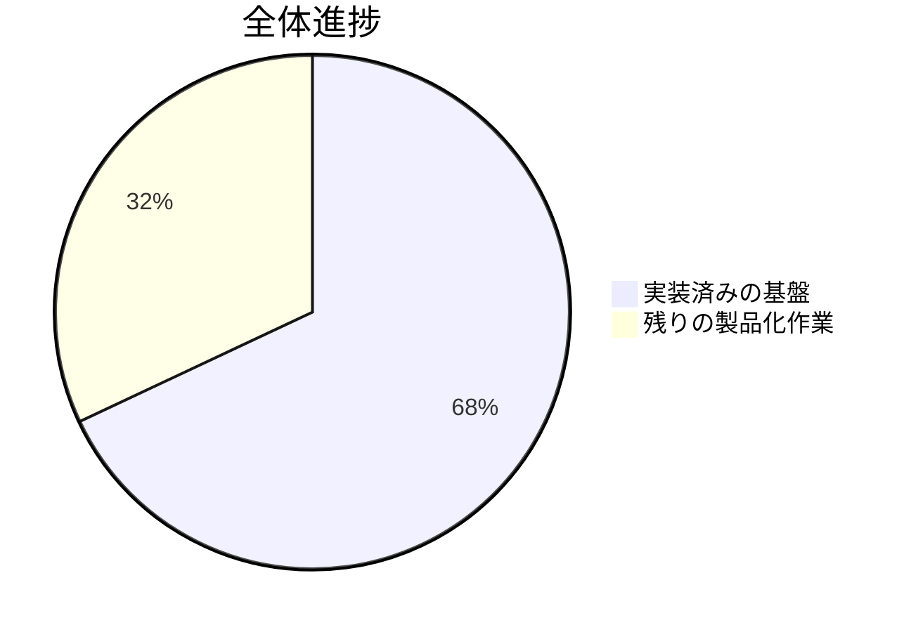
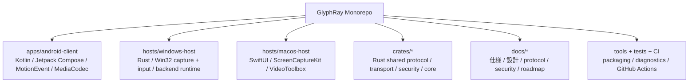
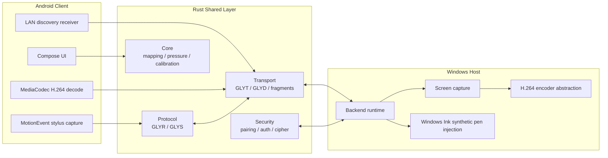
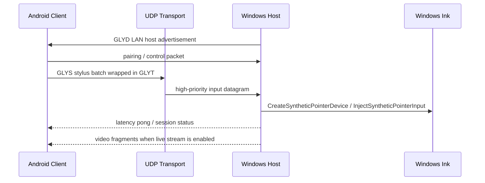
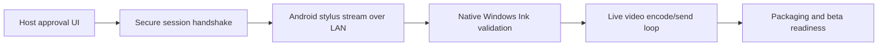

# GlyphRay

[English README](README.md)

GlyphRay は、Android タブレットやスマートフォンを Windows / macOS コンピューターの高品質なリモート・ペンディスプレイとして使うための、低遅延リモートクリエイティブデスクトップアプリです。

目標は、Parsec のような速さ・シンプルさ・低遅延体験を参考にしつつ、コード、UI、ブランド、プロトコル、アーキテクチャは完全にオリジナルにすることです。最大の差別化ポイントは、Android のスタイラス入力、とくに Samsung S Pen の入力を、単なるマウス入力ではなく Windows Ink / native pen input として Windows host に届けることです。

## 現在の進捗

**全体進捗見積もり: 68%**

最終更新: 2026-05-11 JST



| 領域 | 状態 | 進捗 |
| --- | --- | ---: |
| Milestone 1 基盤構築 | 完了 | 100% |
| Milestone 2 映像・transport 基盤 | 進行中 | 86% |
| Milestone 3 Android stylus から Windows Ink | 進行中 | 63% |
| Milestone 4 security hardening / packaging | 進行中 | 46% |
| Milestone 5 macOS / audio / relay | 進行中 | 35% |

```text
M1 基盤構築                  [####################] 100%
M2 映像 + Transport          [#################---]  86%
M3 Stylus -> Windows Ink     [#############-------]  63%
M4 Security + Packaging      [#########-----------]  46%
M5 macOS + Audio + Relay     [#######-------------]  35%
```

開発日記: [docs/DEVELOPMENT_DIARY.md](docs/DEVELOPMENT_DIARY.md)

## リポジトリ全体図



| パス | 役割 | 現在入っているもの |
| --- | --- | --- |
| `apps/android-client` | Android client | Compose UI、LAN host discovery、stylus diagnostics、live stylus UDP sender、MediaCodec decode surface |
| `hosts/windows-host` | 最優先の desktop host | LAN backend runtime、UDP routing、GDI capture fallback、encoder abstraction、Win32 synthetic pen injection wrapper |
| `hosts/macos-host` | Phase 2/5 の desktop host | SwiftUI shell、ScreenCaptureKit display enumeration、VideoToolbox encoder foundation |
| `crates/core` | 共有ロジック | coordinate mapping、calibration、pressure curve、session state |
| `crates/protocol` | binary protocol | `GLYR` frame、compact `GLYS` stylus batch |
| `crates/transport` | realtime packet layer | UDP `GLYT`、LAN discovery `GLYD`、video fragmentation、secure datagram、reconnect、bitrate logic |
| `crates/security` | pairing / session security | pairing code、HMAC challenge response、session cipher、replay guard、secret-store trait |
| `crates/telemetry` | local diagnostics | latency breakdown、rolling metrics |
| `crates/audio` | audio 基盤 | audio packetization primitives |
| `docs` | knowledge base | architecture、security、Windows Ink、Android stylus、macOS、test plan、performance targets |

## システム構成



## 実行時の流れ



## いま実装済みの主な内容

- Rust workspace と共有 crate 群。
- stylus、media、session、pairing、latency、control 用の versioned binary protocol。
- Android と Rust で揃えた高頻度 stylus packet format `GLYS`。
- coordinate mapping、calibration、pressure curve の実装と unit tests。
- Android Compose app の host list / pairing / connection / session / pen settings / video settings / security / diagnostics 画面。
- Android の raw stylus diagnostics。pressure、tilt、orientation、hover、button、eraser、history、timestamp を表示。
- Rust host の `GLYD` advertisement を読む Android LAN discovery。
- remote session の描画面から stylus input を拾い、background worker で compact stylus batch を UDP 送信する Android bridge。
- Android の low-latency `SurfaceView` と `MediaCodec` H.264 decoder 基盤。
- Windows backend runtime。LAN discovery、UDP server routing、session registry、pairing request handling、permission gate、latency pong。
- LAN stylus path の smoke test 用 development auto-approval mode。
- LAN smoke test 用の Windows backend opt-in native pen injection bridge。
- Windows stylus input bridge と Win32 synthetic pen injection wrapper。
- Windows monitor enumeration、GDI capture fallback、encoder abstraction、streaming pipeline の形。
- ChaCha20-Poly1305 session cipher、replay guard、secure datagram codec、reconnect、adaptive bitrate 基盤。
- macOS SwiftUI shell、ScreenCaptureKit、VideoToolbox、CGEvent、audio permission の基盤。
- Rust tests と Android debug build 用 GitHub Actions CI。

## ビルドと実行

### Rust workspace

安定版 Rust を入れて実行します。

```powershell
cargo test --workspace
```

Windows diagnostics:

```powershell
cargo run -p glyphray-pen-diagnostics
cargo run -p glyphray-capture-diagnostics
cargo run -p glyphray-host-diagnostics
```

Windows backend runtime:

```powershell
cargo run -p glyphray-windows-host -- serve
```

host approval UI がまだ無い段階で LAN input path を smoke test する場合だけ、明示的に development auto-approval を有効にします。

```powershell
$env:GLYPHRAY_DEV_AUTO_APPROVE='1'
$env:GLYPHRAY_ENABLE_PEN_INJECTION='1'
cargo run -p glyphray-windows-host -- serve
```

### Android client

Android Studio または Android SDK command-line tools を入れて実行します。

```powershell
gradle :apps:android-client:assembleDebug
```

現在の Android app には、LAN host discovery、stylus diagnostics、session UI、latency overlay、remote-session stylus UDP bridge、H.264 frame 受信用の MediaCodec-backed decoder surface が入っています。

### macOS host

macOS 13+ と Xcode がある環境で実行します。

```bash
cd hosts/macos-host
swift build
```

macOS host はまだ Phase 2/5 の基盤です。native pen injection の主戦場は Windows です。

## 重要ドキュメント

| ドキュメント | 内容 |
| --- | --- |
| [docs/PRODUCT_SPEC.md](docs/PRODUCT_SPEC.md) | product goal、対象ユーザー、制約 |
| [docs/ARCHITECTURE.md](docs/ARCHITECTURE.md) | システム境界と component diagram |
| [docs/PROTOCOL.md](docs/PROTOCOL.md) | binary protocol と message shape |
| [docs/SECURITY.md](docs/SECURITY.md) | threat model と security requirements |
| [docs/WINDOWS_INK_INJECTION.md](docs/WINDOWS_INK_INJECTION.md) | Windows native pen injection notes |
| [docs/ANDROID_STYLUS_CAPTURE.md](docs/ANDROID_STYLUS_CAPTURE.md) | Android stylus capture / packetization |
| [docs/BACKEND.md](docs/BACKEND.md) | Windows backend runtime notes |
| [docs/ROADMAP.md](docs/ROADMAP.md) | milestone checklist |
| [docs/TEST_PLAN.md](docs/TEST_PLAN.md) | validation plan |
| [docs/PERFORMANCE_TARGETS.md](docs/PERFORMANCE_TARGETS.md) | latency / telemetry targets |
| [docs/DEVELOPMENT_DIARY.md](docs/DEVELOPMENT_DIARY.md) | 開発日記 |

## 現在の制限

- この作業環境では `cargo`、`gradle`、`swift`、Android SDK tools が `PATH` に無いため、ローカル full build は未実行です。
- Windows capture は現在 GDI fallback を含みます。本番向けには Windows Graphics Capture または Desktop Duplication へ移行する必要があります。
- H.264 hardware/software encoder backend は、まだ placeholder abstraction から実装へ進める必要があります。
- Android stylus packet は remote display surface から capture して UDP 送信できますが、本番 pairing / session handshake はさらに hardening が必要です。
- host approval UI は未接続です。`GLYPHRAY_DEV_AUTO_APPROVE` は local smoke test 専用です。
- `GLYPHRAY_ENABLE_PEN_INJECTION` は display negotiation / calibration が完全接続されるまで、一時的な 1920x1080 stretch mapping を使います。
- Windows Ink の pressure / tilt / hover は、実際の creative apps で検証が必要です。

## 次に進めること



直近の開発フォーカス:

- Android で選択した host を実 pairing / control channel に接続する。
- Android stylus UDP packet を Windows native pen bridge まで通して LAN smoke test する。
- fallback capture を Windows Graphics Capture または Desktop Duplication に置き換える。
- low-latency H.264 encoder backend を実装する。
- backend runtime から video streaming pipeline を継続駆動する。
