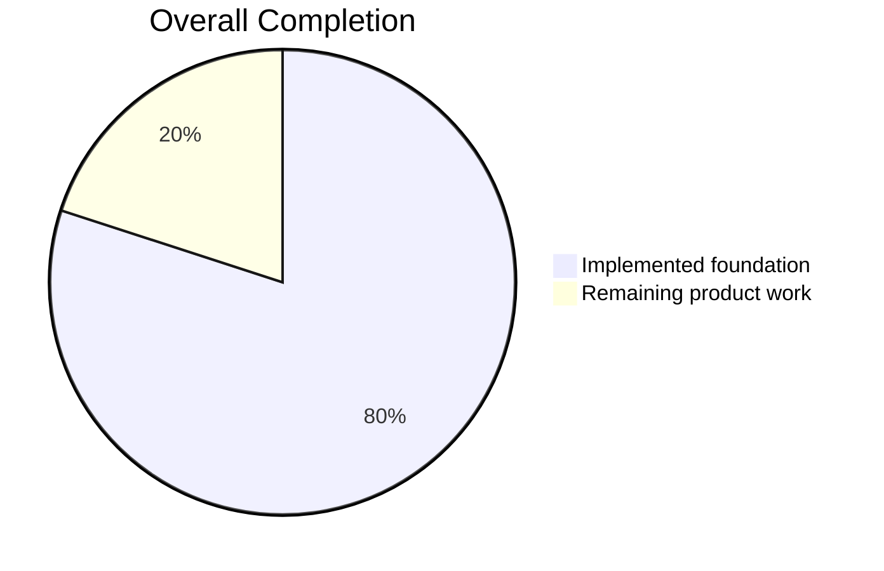
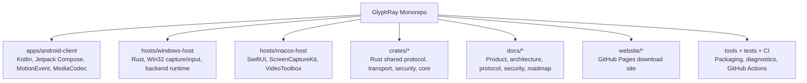
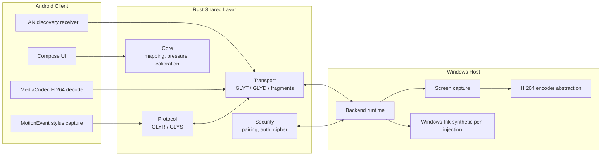
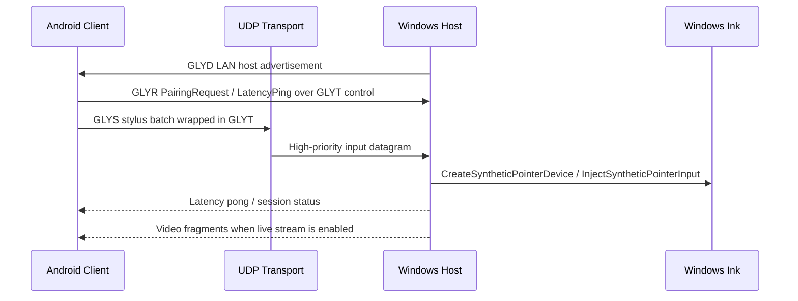
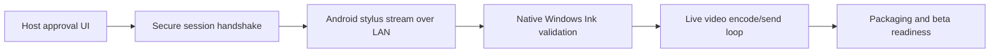

# GlyphRay

[日本語版 README](README.ja.md)

GlyphRay is a low-latency remote creative desktop application for artists, designers, and illustrators who want to use an Android tablet or phone as a high-quality remote pen display for a Windows or macOS computer.

The product goal is Parsec-like speed and simplicity with an original brand, UI, codebase, protocol, and architecture. The key differentiator is native Windows Ink-style pen injection from Android stylus input, not mouse-only emulation.

## Current Progress

**Overall progress estimate: 80%**

Last updated: 2026-05-12 JST



| Area | Status | Progress |
| --- | --- | ---: |
| Milestone 1 foundation | Complete | 100% |
| Milestone 2 video and transport foundation | In progress | 87% |
| Milestone 3 Android stylus to Windows Ink stream | In progress | 78% |
| Milestone 4 hardening and packaging | In progress | 63% |
| Milestone 5 macOS, audio, relay readiness | In progress | 42% |

```text
M1 Foundation                 [####################] 100%
M2 Video + Transport          [#################---]  87%
M3 Stylus -> Windows Ink      [################----]  78%
M4 Security + Packaging       [#############-------]  63%
M5 macOS + Audio + Relay      [########------------]  42%
```

Development diary: [docs/DEVELOPMENT_DIARY.md](docs/DEVELOPMENT_DIARY.md)

## What This Repository Contains



| Path | Purpose | Current State |
| --- | --- | --- |
| `apps/android-client` | Android tablet/phone client | Compose UI, LAN discovery, control handshake send/receive, stylus diagnostics, live stylus UDP sender, MediaCodec decode surface |
| `hosts/windows-host` | Primary desktop host | LAN backend runtime, UDP routing, QoS outbound queues, health/status metrics, pending-peer hardening, console approval, GDI capture fallback, encoder abstraction, Win32 synthetic pen injection wrapper |
| `hosts/macos-host` | Secondary desktop host | SwiftUI shell, ScreenCaptureKit display enumeration, permission readiness UI, Keychain smoke test, VideoToolbox encoder smoke test |
| `crates/core` | Shared math and state | Coordinate mapping, calibration, pressure curves, session state |
| `crates/protocol` | Binary protocol | `GLYR` frames and compact `GLYS` stylus batches |
| `crates/transport` | Real-time packet layer | UDP `GLYT`, LAN discovery `GLYD`, video fragmentation, reusable UDP buffers, secure datagram wrapper, reconnect, bitrate/keyframe adaptation logic |
| `crates/security` | Pairing/session primitives | Pairing codes, HMAC challenge response, session cipher, replay guard, secret-store traits |
| `crates/telemetry` | Local diagnostics | Latency breakdowns and rolling metrics |
| `crates/audio` | Audio foundation | Audio packetization primitives |
| `docs` | Product knowledge base | Architecture, security, Windows Ink, Android stylus, macOS, test plan, performance targets |
| `website` | GitHub Pages site | Static download page, generated hero image, release links, setup command generator |

## System Shape



## Runtime Data Flow



## Implemented Highlights

- Rust workspace for shared core, protocol, transport, security, telemetry, and audio.
- Versioned binary protocol with stylus, media, session, pairing, latency, and control messages.
- Compact high-frequency stylus wire format (`GLYS`) shared by Android and Rust.
- Coordinate mapping, calibration, and pressure-curve logic with unit tests.
- Android Compose app with host list, pairing, connection, session, pen settings, video settings, security, and diagnostics screens.
- Android raw stylus diagnostics for pressure, tilt, orientation, hover, buttons, eraser, history, and timestamps.
- Android LAN host discovery receiver for Rust `GLYD` advertisements.
- Android control channel sender for `PairingRequest` and `LatencyPing` frames wrapped in `GLYT`.
- Android control response receiver for `PairingResult` and `LatencyPong`.
- Android display-info receiver for host monitor geometry after pairing.
- Android video/session settings for resolution, refresh rate, bitrate, color space, codec, touch mode, fullscreen mode, Bluetooth keyboard/mouse capture, game controller capture, and special-key overlay.
- Android manual host entry for Tailscale IP / MagicDNS / direct endpoint use.
- Android remote-session input bridge that sends stylus, native touch, Bluetooth mouse, keyboard, and gamepad packets over UDP on background workers.
- Android low-latency `SurfaceView` and `MediaCodec` H.264 decoder foundation.
- Windows backend runtime with LAN discovery, UDP server routing, session registry, pairing request handling, console approval/rejection, `PairingResult`, display-info responses, encoder config intake, opt-in keyboard/mouse/touch injection, gamepad decode, permission gating, and latency pong replies.
- Windows backend hardening for pending-session caps, per-IP pending attempt rate limiting, late input packet dropping, channel-aware nonblocking QoS outbound queues, and console-visible queue/backpressure health metrics.
- Windows development auto-approval mode for local LAN stylus-path smoke testing.
- Windows backend opt-in native pen injection bridge for LAN smoke tests.
- Windows stylus input bridge and Win32 synthetic pen injection wrapper.
- Windows monitor enumeration, GDI capture fallback, encoder abstraction, and streaming pipeline shape.
- ChaCha20-Poly1305 session cipher, replay guard, secure datagram codec, reconnect, adaptive bitrate decisions, and packet-loss keyframe recovery signaling foundations.
- macOS SwiftUI shell with ScreenCaptureKit display diagnostics, permission readiness checks, VideoToolbox low-latency encoder smoke test, CGEvent mouse/keyboard foundation, Keychain secret-store smoke test, and audio permission plumbing.
- GitHub Actions CI for Rust tests, Android unit tests, and Android debug build.
- GitHub Pages static download site with setup command generator and original hero artwork.

## Build And Run

### Rust Workspace

Install stable Rust, then run:

```powershell
cargo test --workspace
```

Run Windows diagnostics:

```powershell
cargo run -p glyphray-pen-diagnostics
cargo run -p glyphray-capture-diagnostics
cargo run -p glyphray-host-diagnostics
```

Run the Windows backend runtime:

```powershell
cargo run -p glyphray-windows-host -- serve
```

For local input-path smoke testing before the host approval UI exists:

```powershell
$env:GLYPHRAY_DEV_AUTO_APPROVE='1'
$env:GLYPHRAY_ENABLE_PEN_INJECTION='1'
$env:GLYPHRAY_ENABLE_TOUCH_INJECTION='1'
$env:GLYPHRAY_ENABLE_MOUSE_INJECTION='1'
$env:GLYPHRAY_ENABLE_KEYBOARD_INJECTION='1'
cargo run -p glyphray-windows-host -- serve
```

### Android Client

Install Android Studio or Android SDK command-line tools, then run:

```powershell
.\gradlew.bat :apps:android-client:assembleDebug
```

The Android app currently includes LAN host discovery, stylus diagnostics, a session UI, a latency overlay, a remote-session stylus UDP bridge, and a MediaCodec-backed decoder surface prepared for incoming H.264 frames.

JDK 17 remains the safest baseline for Gradle/Android work. The wrapper is pinned to Gradle 8.14.3 so Java 24 local test runs are also supported, though the JVM may print native-access warnings.

```powershell
.\gradlew.bat :apps:android-client:testDebugUnitTest
```

### macOS Host

On macOS 13+ with Xcode installed:

```bash
cd hosts/macos-host
swift build
```

The macOS host is still a Phase 2/5 foundation. Windows remains the primary platform for native pen injection.

## Important Documents

| Document | Why It Matters |
| --- | --- |
| [docs/PRODUCT_SPEC.md](docs/PRODUCT_SPEC.md) | Product goals, target users, and constraints |
| [docs/ARCHITECTURE.md](docs/ARCHITECTURE.md) | System boundaries and component diagrams |
| [docs/PROTOCOL.md](docs/PROTOCOL.md) | Binary protocol and message shape |
| [docs/SECURITY.md](docs/SECURITY.md) | Threat model and security requirements |
| [docs/WINDOWS_INK_INJECTION.md](docs/WINDOWS_INK_INJECTION.md) | Windows native pen injection notes |
| [docs/ANDROID_STYLUS_CAPTURE.md](docs/ANDROID_STYLUS_CAPTURE.md) | Android stylus capture and packetization |
| [docs/BACKEND.md](docs/BACKEND.md) | Windows backend runtime notes |
| [docs/ROADMAP.md](docs/ROADMAP.md) | Milestone checklist |
| [docs/TEST_PLAN.md](docs/TEST_PLAN.md) | Validation plan |
| [docs/PERFORMANCE_TARGETS.md](docs/PERFORMANCE_TARGETS.md) | Latency and telemetry targets |
| [docs/FEATURE_MATRIX.md](docs/FEATURE_MATRIX.md) | Implementation status for video, input, fullscreen, special keys, and host startup |
| [docs/NETWORK_COMPATIBILITY.md](docs/NETWORK_COMPATIBILITY.md) | LAN, Tailscale, and overlay VPN notes |
| [docs/RELEASE_DISTRIBUTION.md](docs/RELEASE_DISTRIBUTION.md) | Windows/macOS installers and Play Store release path |
| [docs/DEVELOPMENT_DIARY.md](docs/DEVELOPMENT_DIARY.md) | Running development diary |

## Website

The GitHub Pages site lives in [website](website). It is frontend-only and can be opened directly:

```powershell
Start-Process .\website\index.html
```

Deployment is handled by [pages.yml](.github/workflows/pages.yml). Enable Pages once in repository settings and choose GitHub Actions as the source before rerunning the workflow. GitHub does not always allow the workflow token to create the Pages site automatically.

## Current Limits

- Rust tests and Android debug builds have been exercised on Windows. Android unit tests should be run with JDK 17.
- The host router now has in-memory DoS guards and console-visible health counters for pending peer spam and outbound backpressure, but production pairing still needs persistent trust storage and UI-driven approvals.
- Windows capture currently has a GDI fallback; production should move to Windows Graphics Capture or Desktop Duplication.
- A concrete H.264 hardware/software encoder backend still needs to replace the placeholder abstraction.
- Android stylus packets can be captured from the remote display surface and sent over UDP, but the complete production pairing and session handshake still needs hardening.
- Host approval UI is not wired yet; `GLYPHRAY_DEV_AUTO_APPROVE` is only for local smoke tests.
- `GLYPHRAY_ENABLE_PEN_INJECTION` uses temporary 1920x1080 stretch mapping until display negotiation and calibration are fully wired.
- `GLYPHRAY_ENABLE_TOUCH_INJECTION`, `GLYPHRAY_ENABLE_MOUSE_INJECTION`, and `GLYPHRAY_ENABLE_KEYBOARD_INJECTION` are explicit smoke-test flags until host-side permission UI exists.
- Gamepad packets are decoded on Windows, but virtual controller injection still needs a ViGEm/virtual HID backend.
- Native Windows Ink pressure/tilt/hover must still be validated in real creative apps.

## Next Focus



Immediate engineering focus:

- Replace console host approval with a native host UI prompt.
- Connect Android stylus UDP packets to the Windows native pen bridge in a full LAN smoke test.
- Replace fallback capture with Windows Graphics Capture or Desktop Duplication.
- Add a concrete low-latency H.264 encoder backend.
- Drive the video streaming pipeline continuously from the backend runtime.
