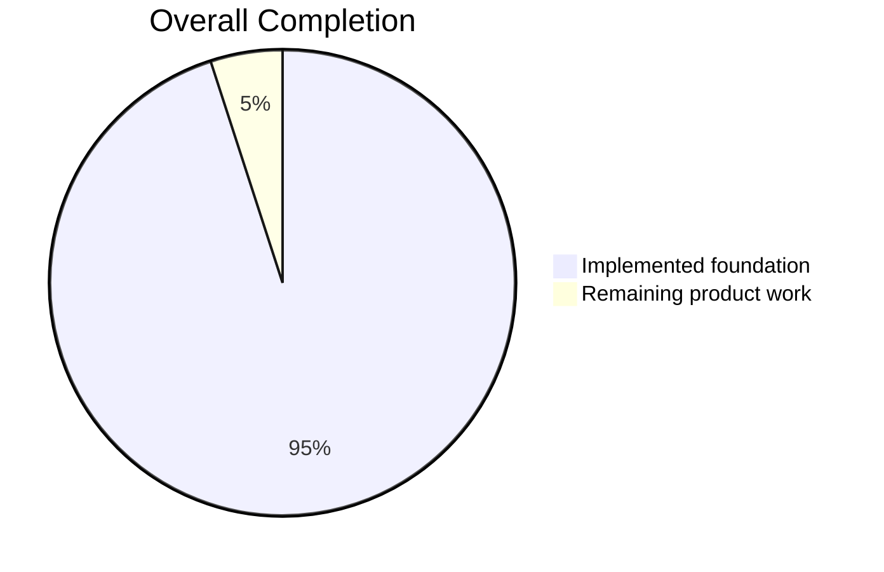
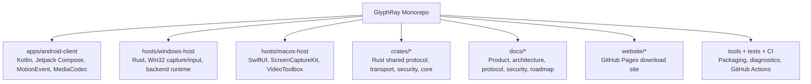
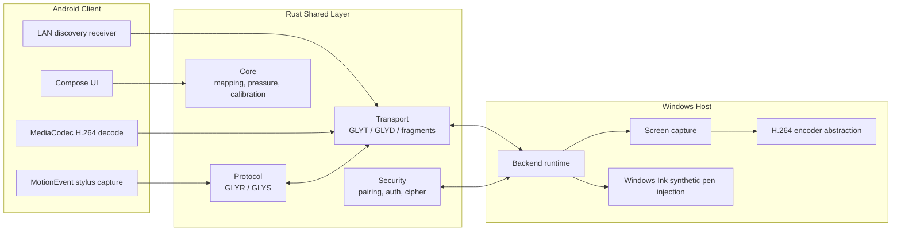
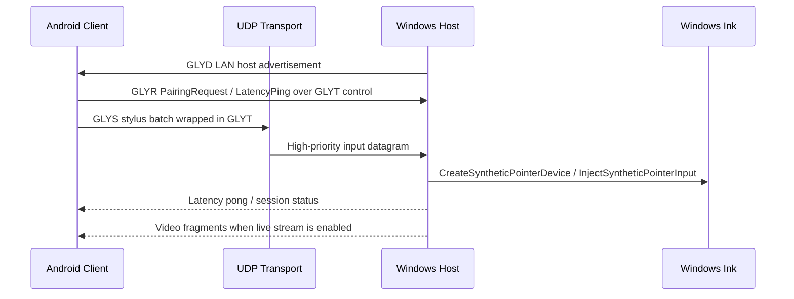
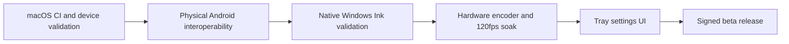

# GlyphRay

[日本語版 README](README.ja.md)

GlyphRay is a low-latency remote creative desktop application for artists, designers, and illustrators who want to use an Android tablet or phone as a high-quality remote pen display for a Windows or macOS computer.

The product goal is Parsec-like speed and simplicity with an original brand, UI, codebase, protocol, and architecture. The key differentiator is native Windows Ink-style pen injection from Android stylus input, not mouse-only emulation.

## Current Progress

**Implementation progress estimate: 95%**<br>
**Production release readiness: 82%**

Last updated: 2026-06-23 JST



| Area | Status | Progress |
| --- | --- | ---: |
| Milestone 1 foundation | Complete | 100% |
| Milestone 2 video and transport foundation | In progress | 93% |
| Milestone 3 Android stylus to Windows Ink stream | In progress | 86% |
| Milestone 4 hardening and packaging | In progress | 98% |
| Milestone 5 macOS, audio, relay readiness | In progress | 90% |

```text
M1 Foundation                 [####################] 100%
M2 Video + Transport          [###################-]  93%
M3 Stylus -> Windows Ink      [#################---]  86%
M4 Security + Packaging       [####################]  98%
M5 macOS + Audio + Relay      [##################--]  90%
```

Development diary: [docs/DEVELOPMENT_DIARY.md](docs/DEVELOPMENT_DIARY.md)

The earlier 98% estimate measured repository scaffolding. The current percentages use stricter release gates: a real desktop encoder, encrypted live sessions, signed/notarized installers, hardware validation, and store compliance all count as required work.

## Release Candidate Pipeline

`VERSION` is the canonical release-version source; CI rejects drift from Cargo's required version mirror. The `Release Candidate` GitHub Actions workflow builds an Android APK/AAB, Windows MSI, macOS app/pkg, and a SHA-256 manifest. Manual runs may produce unsigned engineering candidates; tagged releases are blocked unless all platform signing secrets and macOS notarization credentials are present.

Release procedure: [docs/RELEASE_RUNBOOK.md](docs/RELEASE_RUNBOOK.md)

## What This Repository Contains



| Path | Purpose | Current State |
| --- | --- | --- |
| `apps/android-client` | Android tablet/phone client | Compose UI, LAN discovery, control handshake send/receive, Android Keystore public-key pairing identity, stylus diagnostics, live stylus UDP sender, MediaCodec decode surface, PCM16 AudioFrame playback foundation |
| `hosts/windows-host` | Primary desktop host | LAN backend runtime, UDP routing, QoS outbound queues, DXGI Desktop Duplication capture, Media Foundation hardware/software H.264 selection, approved-peer video and audio packet queueing, health/status metrics, native permission dialog, signed trusted-device challenge/response, Win32 synthetic pen injection wrapper, virtual gamepad injection bridge |
| `hosts/macos-host` | Secondary desktop host | SwiftUI shell, Keychain host/trusted-client identities, signed P-256 ECDH + AES-GCM sessions, encrypted control/video/input routing, secure-client stream ownership, ScreenCaptureKit, VideoToolbox H.264, client-selected display/quality settings, bounded video backpressure, CGEvent mouse/keyboard and single-touch pointer injection |
| `crates/core` | Shared math and state | Coordinate mapping, calibration, pressure curves, session state |
| `crates/protocol` | Binary protocol | `GLYR` frames and compact `GLYS` stylus batches |
| `crates/transport` | Real-time packet layer | UDP `GLYT`, LAN discovery `GLYD`, video fragmentation, reusable UDP buffers, secure datagram wrapper, reconnect, bitrate/keyframe adaptation logic |
| `crates/security` | Pairing/session primitives | Pairing codes, HMAC challenge response, session cipher, replay guard, secret-store traits |
| `crates/telemetry` | Local diagnostics | Latency breakdowns and rolling metrics |
| `crates/audio` | Audio foundation | Audio packetization primitives shared with Windows host Audio-channel packetization and Android `AudioTrack` playback |
| `docs` | Product knowledge base | Architecture, security, Windows Ink, Android stylus, macOS, test plan, performance targets |
| `website` | GitHub Pages site | Static download page, generated hero image, release links, setup command generator |

## System Shape



## Runtime Data Flow



## Implemented Highlights

- Rust workspace for shared core, protocol, transport, security, telemetry, and audio.
- Versioned binary protocol with stylus, media, session, pairing, latency, and control messages.
- Compact high-frequency stylus wire format (`GLYS`) shared by Android and Rust.
- Coordinate mapping, calibration, and pressure-curve logic with unit tests.
- Android Compose app with polished host list, pairing, connection readiness, session cockpit, pen settings, video settings, security, and diagnostics screens.
- Android raw stylus diagnostics for pressure, tilt, orientation, hover, buttons, eraser, history, and timestamps.
- Android LAN host discovery receiver for Rust `GLYD` advertisements.
- Android control channel sender for `PairingRequest` and `LatencyPing` frames wrapped in `GLYT`; pairing now includes the Android Keystore public key bytes for host-side device fingerprinting.
- Android control response receiver for `PairingResult` and `LatencyPong`.
- Android display-info receiver for host monitor geometry after pairing.
- Android video settings can select a discovered host display, and the selected display id is sent with stylus, touch, and mouse input packets.
- Android video/session settings for resolution, refresh rate, bitrate, color space, codec, touch mode, fullscreen mode, Bluetooth keyboard/mouse capture, game controller capture, and special-key overlay.
- Android persists video and input preferences so stream quality, touch mode, capture toggles, and fullscreen preference survive app restarts.
- Android session fullscreen now hides system bars with immersive mode and keeps the screen awake during active sessions.
- Android manual host entry for Tailscale IP / MagicDNS / direct endpoint use, with saved endpoints restored into the host list.
- Android remote-session input bridge that sends stylus, native touch, Bluetooth mouse, keyboard, and gamepad packets over UDP on QoS-aware background workers.
- Android touch modes now include direct native touch, trackpad-style cursor movement, and two-finger gesture wheel translation.
- Android realtime receive path can route `VideoFrame` packets from the transport socket into `RemoteVideoStreamController` and the MediaCodec decoder.
- Android low-latency `SurfaceView` and `MediaCodec` H.264 decoder foundation.
- Windows backend runtime with LAN discovery, UDP server routing, session registry, pairing request handling, console approval/rejection, optional native permission dialogs, `PairingResult`, display-info responses, encoder config intake, opt-in keyboard/mouse/touch injection, gamepad decode plus virtual-controller injection bridge, permission gating, and latency pong replies.
- Windows backend hardening for pending-session caps, per-IP pending attempt rate limiting, late input packet dropping, channel-aware nonblocking QoS outbound queues, approved-peer video fragment queueing, and console-visible queue/backpressure health metrics.
- Windows host records approved devices into local host settings, stores the Android public-key SHA-256 fingerprint and DER public key when available, challenges returning devices with `AuthChallenge`, verifies the Android Keystore ECDSA `AuthResponse`, and exposes `trust list`, `trust forget <id>`, and `trust clear` management commands.
- Windows host video pump can restart from approved client `EncoderConfig` and has a console `encoder override` command for host-side stream control.
- Windows host can persist a default encoder override with `encoder save`, reload it on backend startup, clear it with `encoder clear`, and manage named stream presets with `encoder preset save|apply|delete|list`.
- Windows host can show an opt-in Win32 connection permission dialog for incoming pairing requests with `GLYPHRAY_ENABLE_PERMISSION_DIALOG=1`.
- Windows host supports per-user startup-at-login management with `startup status`, `startup enable`, and `startup disable`.
- Windows runtime input bridges now derive their mapper from the selected display geometry instead of a fixed smoke-test rectangle when the display can be enumerated.
- Windows stylus bridge now normalizes pen axes and smooths pressure before calling the native Win32 synthetic pen injector.
- Windows development auto-approval mode for local LAN stylus-path smoke testing.
- Windows backend opt-in native pen injection bridge for LAN smoke tests.
- Windows stylus input bridge and Win32 synthetic pen injection wrapper.
- Windows DXGI monitor enumeration with active refresh/DPI metadata, stateful Desktop Duplication capture, rotation-aware BGRA readback, encoder abstraction, and streaming pipeline.
- Windows Media Foundation H.264 now enumerates hardware MFTs, classifies Intel Quick Sync/NVIDIA NVENC/AMD AMF, drives asynchronous MFT events, falls back to software in Auto mode, and exposes the selected backend in status/diagnostics. NVENC was verified locally through Annex B encoding and UDP fragment reassembly.
- Windows host settings and DPAPI identity files use atomic replacement, quarantine corrupt state, and regenerate with explicit re-pairing warnings. Fixed-schema rotating event logs suppress raw keyboard data and secret material.
- Live Windows/Android session encryption with signed P-256 ECDH, directional AES-256-GCM keys, replay protection, Android host-identity pinning, and DPAPI-persisted Windows host identity.
- First-time Android pairing now requires a six-digit one-time code shown by the Windows or macOS host. A per-peer 32-byte salt, HMAC-SHA256 proof, expiry, one-use rotation, and five-attempt/two-minute rate window prevent plaintext code disclosure and cross-peer proof replay.
- Windows `PlatformSecretStore` uses DPAPI-protected per-user secret files on Windows, with an in-memory fallback on non-Windows builds.
- macOS SwiftUI host with Keychain-backed persistent host identity and trusted clients, signed `GLYH` P-256 ECDH, directional AES-256-GCM `GLYE` sessions, replay rejection, secure-target stream ownership, encrypted approved-client video, encrypted mouse/keyboard/single-touch routing, LAN discovery, encrypted display metadata, client-selected display/resolution/FPS/bitrate/keyframe settings, ScreenCaptureKit capture, VideoToolbox H.264, Annex B conversion, bounded send backpressure metrics, and permission diagnostics.
- GitHub Actions CI for Rust tests, Android unit tests, Android debug build, and macOS SwiftPM host build on `macos-14`.
- GitHub Pages static download site with setup command generator and original hero artwork.

## Build And Run

### Rust Workspace

Install stable Rust, then run:

```powershell
cargo test --workspace
```

Run Windows diagnostics:

```powershell
cargo run -p glyphray-pen-diagnostics
cargo run -p glyphray-capture-diagnostics
cargo run -p glyphray-encoder-diagnostics
cargo run -p glyphray-host-diagnostics
```

The encoder defaults to hardware-first Auto selection. Force a backend for validation with `GLYPHRAY_ENCODER_BACKEND=hardware|intel|nvidia|amd|software`; `glyphray-encoder-diagnostics` prints discovered MFTs and the backend that actually started. On the current Windows test machine, optimized NVENC encoded a synthetic 1280x720 keyframe in 8.174 ms, after which the diagnostic packetized and losslessly reassembled it. Interactive Desktop Duplication and sustained Android-device measurements remain required before treating this as an end-to-end latency result.

Run the Windows backend runtime:

```powershell
cargo run -p glyphray-windows-host -- serve
```

On first connection, the host prints a six-digit one-time pairing code and Android opens a numeric verification field. Enter that code before approving the device. Returning trusted devices use their Android Keystore signature and do not ask for the code again.

While the backend is running, `encoder status`, `encoder override 1920x1080 120 35000`, `encoder save`, `encoder preset save studio-120`, `encoder preset apply studio-120`, `encoder preset delete studio-120`, and `encoder clear` are available in the host console for stream-control smoke tests. `encoder save` persists the active host override, or the latest approved client `EncoderConfig`, and reloads it on the next backend start. Named presets are stored alongside the default override for quick 60fps/120fps/bitrate switching during hardware validation.

Manage user-logon startup:

```powershell
cargo run -p glyphray-windows-host -- startup status
cargo run -p glyphray-windows-host -- startup enable
cargo run -p glyphray-windows-host -- startup disable
```

For native host-side pairing approval during LAN tests:

```powershell
$env:GLYPHRAY_ENABLE_PERMISSION_DIALOG='1'
cargo run -p glyphray-windows-host -- serve
```

Trusted-device management commands are available in the running host console:

```powershell
trust list
trust forget trusted-192-168-1-20-44999
trust clear
```

For local input-path smoke testing when you deliberately want to bypass approval:

```powershell
$env:GLYPHRAY_DEV_AUTO_APPROVE='1'
cargo run -p glyphray-windows-host -- serve
```

Video and native pen/touch/mouse/keyboard paths are enabled by default after explicit pairing, authenticated key exchange, and per-device permission checks. For isolated diagnostics, use the corresponding `GLYPHRAY_DISABLE_VIDEO_STREAM`, `GLYPHRAY_DISABLE_PEN_INJECTION`, `GLYPHRAY_DISABLE_TOUCH_INJECTION`, `GLYPHRAY_DISABLE_MOUSE_INJECTION`, or `GLYPHRAY_DISABLE_KEYBOARD_INJECTION` environment variable.

### Android Client

Install Android Studio or Android SDK command-line tools, then run:

```powershell
.\gradlew.bat :apps:android-client:assembleDebug
```

The Android app currently includes LAN host discovery, stylus diagnostics, a session UI, a latency overlay, a remote-session stylus UDP bridge, and a MediaCodec-backed decoder surface prepared for incoming H.264 frames.

JDK 17 remains the safest baseline for Gradle/Android work. The wrapper is pinned to Gradle 8.14.3 so Java 24 local test runs are also supported, though the JVM may print native-access warnings.

```powershell
.\gradlew.bat :apps:android-client:testDebugUnitTest
```

### macOS Host

On macOS 13+ with Xcode installed:

```bash
cd hosts/macos-host
swift test -c release
swift build -c release
```

GitHub Actions also verifies this package in the `macOS host SwiftPM build` job from [ci.yml](.github/workflows/ci.yml), which is the preferred check when developing from Windows.

The macOS host now has an encrypted Android session path, but it still requires macOS CI and physical-device interoperability validation. Windows remains the primary platform for native pen injection.

## Important Documents

| Document | Why It Matters |
| --- | --- |
| [docs/PRODUCT_SPEC.md](docs/PRODUCT_SPEC.md) | Product goals, target users, and constraints |
| [docs/ARCHITECTURE.md](docs/ARCHITECTURE.md) | System boundaries and component diagrams |
| [docs/PROTOCOL.md](docs/PROTOCOL.md) | Binary protocol and message shape |
| [docs/SECURITY.md](docs/SECURITY.md) | Threat model and security requirements |
| [docs/WINDOWS_INK_INJECTION.md](docs/WINDOWS_INK_INJECTION.md) | Windows native pen injection notes |
| [docs/ANDROID_STYLUS_CAPTURE.md](docs/ANDROID_STYLUS_CAPTURE.md) | Android stylus capture and packetization |
| [docs/BACKEND.md](docs/BACKEND.md) | Windows backend runtime notes |
| [docs/WINDOWS_STARTUP_AND_SERVICE.md](docs/WINDOWS_STARTUP_AND_SERVICE.md) | Startup-at-login implementation and service/agent constraints |
| [docs/ROADMAP.md](docs/ROADMAP.md) | Milestone checklist |
| [docs/TEST_PLAN.md](docs/TEST_PLAN.md) | Validation plan |
| [docs/PERFORMANCE_TARGETS.md](docs/PERFORMANCE_TARGETS.md) | Latency and telemetry targets |
| [docs/FEATURE_MATRIX.md](docs/FEATURE_MATRIX.md) | Implementation status for video, input, fullscreen, special keys, and host startup |
| [docs/NETWORK_COMPATIBILITY.md](docs/NETWORK_COMPATIBILITY.md) | LAN, Tailscale, and overlay VPN notes |
| [docs/RELEASE_DISTRIBUTION.md](docs/RELEASE_DISTRIBUTION.md) | Windows/macOS installers and Play Store release path |
| [docs/DEVELOPMENT_DIARY.md](docs/DEVELOPMENT_DIARY.md) | Running development diary |

## Website

The GitHub Pages site lives in [website](website). It is frontend-only and can be opened directly:

```powershell
Start-Process .\website\index.html
```

Deployment is handled by [pages.yml](.github/workflows/pages.yml). Enable Pages once in repository settings and choose GitHub Actions as the source before rerunning the workflow. GitHub does not always allow the workflow token to create the Pages site automatically.

## Current Limits

- Rust tests and Android debug builds have been exercised on Windows. Android unit tests should be run with JDK 17.
- The host router now has in-memory DoS guards, console-visible health counters, an opt-in native permission dialog, and public-key challenge/response trusted-device authentication for returning Android devices.
- Windows capture now uses DXGI Desktop Duplication. The current Codex automation session denies `DuplicateOutput`, so continuous capture still needs validation from a normal interactive Windows desktop and lock/unlock recovery testing.
- Media Foundation H.264 access units feed the approved-client Video queue, with hardware MFT selection and NVENC verified locally. Intel/AMD-specific and continuous Android-device validation remain.
- Android stylus packets can be captured from the remote display surface and sent over UDP, but the complete production pairing and session handshake still needs hardening.
- The permission dialog and trusted-device commands are minimal host-console features, not a full tray/settings UI yet. `GLYPHRAY_DEV_AUTO_APPROVE` remains only for local smoke tests.
- macOS now seals control, video, mouse, keyboard, and single-touch pointer traffic with the shared signed `GLYH` / AES-GCM `GLYE` session, sends display metadata after key confirmation, applies client video settings, and owns video streams by secure target. macOS CI, physical Android validation, long-run reconnect/backpressure soak tests, and multi-touch semantics are still required.
- Native input is accepted only from an authenticated encrypted session and is checked against persisted per-device pen/touch/keyboard/mouse/gamepad permissions. Console permission editing is available; a full tray/settings UI remains.
- Gamepad packets now flow through the Windows router and virtual gamepad bridge with normalized XInput-style reports. A real ViGEm/virtual HID native binding and signed driver validation still remain before gamepad support is production-ready.
- Native Windows Ink pressure/tilt/hover must still be validated in real creative apps.

## Next Focus



Immediate engineering focus:

- Promote the native permission dialog and trusted-device commands into a tray/settings UI.
- Validate the macOS encrypted session in GitHub Actions and against a physical Android device, then run long reconnect and backpressure soak tests.
- Connect Android stylus UDP packets to the Windows native pen bridge in a full LAN smoke test.
- Validate Desktop Duplication access-loss recovery and continuous 1080p60/120fps capture on supported interactive Windows desktops.
- Validate continuous capture/encode/send/decode against a physical Android device.
- Validate Intel/AMD hardware MFTs, continuous 1080p60 Android decode, and adaptive reconnect under sustained loss.
