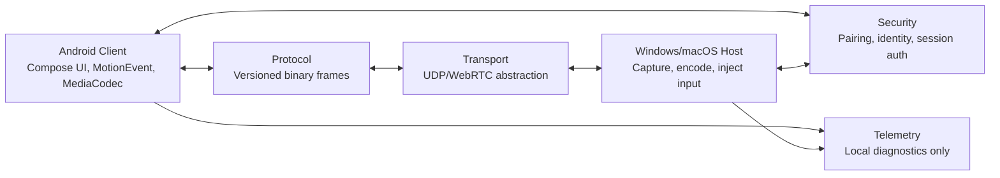
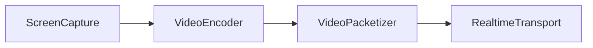
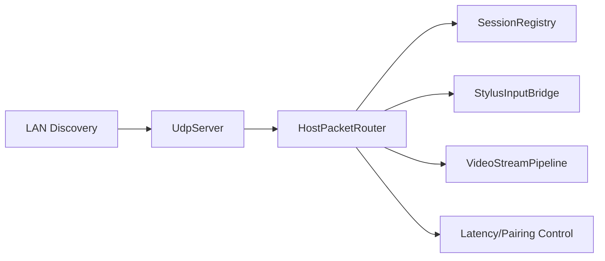

# Architecture

## High-Level Components

## Crate Boundaries

- `crates/audio`: audio packetization primitives.
- `crates/protocol`: schema types and binary frame encoding/decoding.
- `crates/core`: pressure curves, coordinate mapping, session state.
- `crates/security`: pairing codes, challenge response, rate limiting, secret store traits.
- `crates/transport`: channel priorities, real-time transport trait, packet simulation tests.
- `crates/telemetry`: local metric samples and latency breakdowns.

## Android Client

The Android app owns:

- Compose navigation and screens.
- Raw stylus capture through `MotionEvent`.
- Pressure curve and mapping UI.
- Hardware video decode through MediaCodec in Milestone 2.
- Secure device identity through Android Keystore in a platform module.
- Compact stylus packet encoding for high-frequency `GLYS` input batches.

## Windows Host

The Windows host owns:

- Pairing and trusted device management.
- Selected monitor capture.
- H.264 encode abstraction.
- Native synthetic pen injection using Win32 pointer APIs.
- Fallback mouse injection when pen injection is unavailable.

Unsafe/native code is isolated under `hosts/windows-host/src/input/win32_pen.rs`.

Milestone 2 also includes a video streaming pipeline:

Windows capture uses stateful DXGI Desktop Duplication with D3D11 staging readback, rotation correction, unchanged-frame reuse, and access-loss session recreation. Media Foundation enumerates hardware H.264 MFTs, drives asynchronous transforms, and falls back to the Microsoft software MFT in Auto mode.

## macOS Host

The macOS host is parallel in structure but lower priority:

- SwiftUI shell.
- ScreenCaptureKit display enumeration and live capture.
- VideoToolbox low-latency H.264 encoding and GlyphRay video packetization.
- Encrypted CGEvent mouse/keyboard/single-touch pointer input.
- Permission readiness checks for Screen Recording, Accessibility, Input Monitoring, and audio.
- Keychain-backed host identity and trusted-client storage with corrupt-record quarantine.

Windows Ink-style pen injection remains Windows-specific.

## Security And Transport

Windows, Android, and macOS use a signed P-256 ECDH `GLYH` handshake to derive separate directional AES-256-GCM keys. Complete `GLYT` packets are sealed as replay-protected `GLYE` datagrams; post-handshake plaintext is rejected. Relay selection remains optional and prefers direct trusted LAN routes.

## Backend Runtime

The Windows backend runtime owns LAN discovery, UDP packet receive/send, session state, permission gating, and routing into input/video/control handlers.

Backend notes live in `docs/BACKEND.md`.

Runtime resilience rules:

- Unknown UDP peers may create pending sessions only up to a bounded cap; oldest pending peers are evicted before memory can grow without limit.
- New pending peers are rate limited per source IP so one address cannot starve other pending devices by rotating ports.
- Approved input packets are accepted only from an authenticated encrypted session, when the device-specific input permission allows that message family, and when transport sequence/timestamp watermarks are current.
- Outbound packets use channel-specific bounded queues and a QoS schedule that prioritizes input/control over audio/video.
- Sends are flushed nonblocking so packet receive/poll work is not coupled to temporary socket send pressure.
- Backend health snapshots expose session counts, queue depths, drops, late input drops, rate limits, and backpressure counters to the local host console.
- Host discovery IDs use a stable CRC-based hash rather than ad hoc byte folding.

## Audio And Relay

Audio packetization and relay candidate selection exist as code-level foundations. Capture/playback and relay server/client implementations remain future work.
