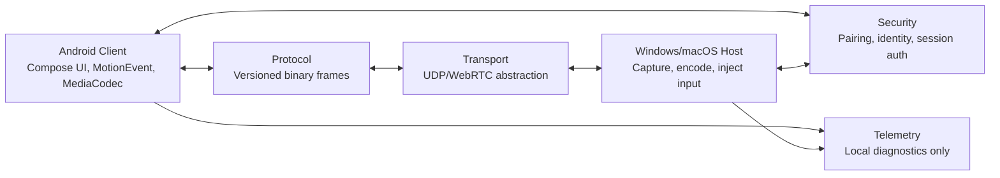

# Architecture

## High-Level Components

## Crate Boundaries

- `crates/protocol`: schema types and binary frame encoding/decoding.
- `crates/core`: pressure curves, coordinate mapping, session state.
- `crates/security`: pairing codes, challenge response, rate limiting, secret store traits.
- `crates/transport`: channel priorities, real-time transport trait, packet simulation tests.
- `crates/telemetry`: local metric samples and latency breakdowns.

## Android Client

The Android app owns:

- Compose navigation and screens.
- Raw stylus capture through `MotionEvent`.
- Pressure curve and mapping UI.
- Hardware video decode through MediaCodec in Milestone 2.
- Secure device identity through Android Keystore in a platform module.

## Windows Host

The Windows host owns:

- Pairing and trusted device management.
- Selected monitor capture.
- H.264 encode abstraction.
- Native synthetic pen injection using Win32 pointer APIs.
- Fallback mouse injection when pen injection is unavailable.

Unsafe/native code is isolated under `hosts/windows-host/src/input/win32_pen.rs`.

## macOS Host

The macOS host is parallel in structure but lower priority:

- SwiftUI shell.
- ScreenCaptureKit for capture.
- VideoToolbox for H.264/H.265 encoding.
- CGEvent mouse/keyboard input first.

Windows Ink-style pen injection remains Windows-specific.

